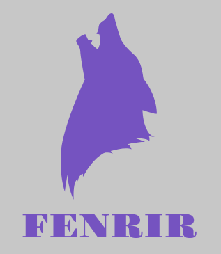
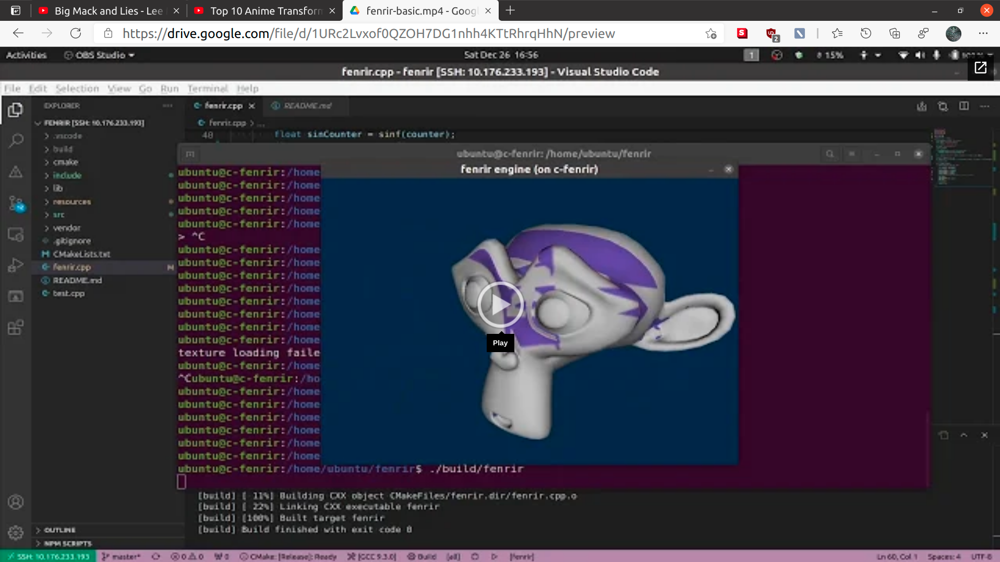

CPP-FENRIR-ENGINE (`WORK IN PROGRESS`)
===================================

    

Fenrir is primarily a hobby project. It is a simple rendering and physics engine based on OpenGL.

# Phase 1

Implement basic OpenGL functionalities. References:

1. [theBennyBox][__BENNY_BOX_MOPENGL__]
2. [OGL dev][__OGLDEV__]

[][__DEMO_BASIC__]

# Phase 2

> in progress

---

[__SDL_SETUP_HELP__]: https://www.youtube.com/watch?v=7sIBklOTImI
[__BENNY_BOX_MOPENGL__]: https://youtube.com/playlist?list=PLEETnX-uPtBXT9T-hD0Bj31DSnwio-ywh
[__OGLDEV__]: http://ogldev.atspace.co.uk/
[__DEMO_BASIC__]: https://drive.google.com/file/d/1URc2Lvxof0QZOH7DG1nhh4KTtRhrqHhN/preview